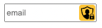

# Privacy Relay Chrome Extension

The motivation behind this extension is similar to the privacy relay provided by apple. It should hide your real inbox behind a randomly generated email address. This is extremly helpfull if you do a lot of research, downloading whitepaper, subscribing to newsletter without exposing your company or private email address.

*How does it help?*

* If there is an data leak and one of your randomly generated email addresses is exposed to spam, you can block all incomming message from this single email addresses. (Also you see who leaked the email address)
* There is no instant visible information about you company trough the domain
* You will still get the information you want

## How To Use It

**Requirements**
To use this extension you will need an catch-all address which redirects all email to your desired inbox.

**Setup**
After installing, you have to go to the settings screen by right click on the extension icon. Insert your domain/subdomain you want to use for address generation.

**Use**
If an email field is recognized in the html a button will be inserted in the input field. This only works with loaded email fields. If the field is in a popup, click on the extension icon and hit "generate & fill".

## Licence

Copyright 2022 mrmonk.dev

Permission is hereby granted, free of charge, to any person obtaining a copy of this software and associated documentation files (the "Software"), to deal in the Software without restriction, including without limitation the rights to use, copy, modify, merge, publish, distribute, sublicense, and/or sell copies of the Software, and to permit persons to whom the Software is furnished to do so, subject to the following conditions:

The above copyright notice and this permission notice shall be included in all copies or substantial portions of the Software.

THE SOFTWARE IS PROVIDED "AS IS", WITHOUT WARRANTY OF ANY KIND, EXPRESS OR IMPLIED, INCLUDING BUT NOT LIMITED TO THE WARRANTIES OF MERCHANTABILITY, FITNESS FOR A PARTICULAR PURPOSE AND NONINFRINGEMENT. IN NO EVENT SHALL THE AUTHORS OR COPYRIGHT HOLDERS BE LIABLE FOR ANY CLAIM, DAMAGES OR OTHER LIABILITY, WHETHER IN AN ACTION OF CONTRACT, TORT OR OTHERWISE, ARISING FROM, OUT OF OR IN CONNECTION WITH THE SOFTWARE OR THE USE OR OTHER DEALINGS IN THE SOFTWARE.

### Icons
**icons** from [uxwing](https://uxwing.com/privacy-icon/)